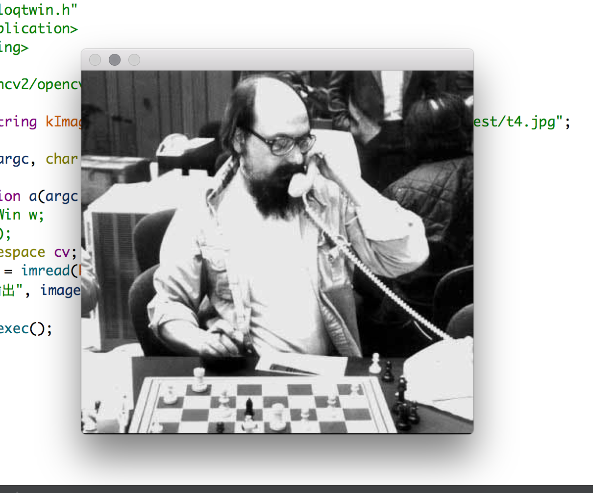

## Qt简介


## OpenCV简介


## 安装Qt


## 安装OpenCV


## 测试

通过以前的步骤，我们已经将Qt和OpenCV库安装到了电脑中，下面就通过一个示例测试一下安装是否成功，并测试第一个例子。

1. 在qt_creater中新建一个项目，起名叫做hello_qt项目。

   项目结构如图所示，

   

2. 将OpenCV的库路径增加到hello_qt项目中，以便编译程序时让IDE找到OpenCV。

   首先，使用pkg-config

```shell
➜  ~ pkg-config --cflags opencv
-I/usr/local/Cellar/opencv/3.4.3/include/opencv -I/usr/local/Cellar/opencv/3.4.3/include
➜  ~ pkg-config --libs opencv    
-L/usr/local/Cellar/opencv/3.4.3/lib -lopencv_stitching -lopencv_superres -lopencv_videostab -lopencv_aruco -lopencv_bgsegm -lopencv_bioinspired -lopencv_ccalib -lopencv_dnn_objdetect -lopencv_dpm -lopencv_face -lopencv_photo -lopencv_fuzzy -lopencv_hfs -lopencv_img_hash -lopencv_line_descriptor -lopencv_optflow -lopencv_reg -lopencv_rgbd -lopencv_saliency -lopencv_stereo -lopencv_structured_light -lopencv_phase_unwrapping -lopencv_surface_matching -lopencv_tracking -lopencv_datasets -lopencv_dnn -lopencv_plot -lopencv_xfeatures2d -lopencv_shape -lopencv_video -lopencv_ml -lopencv_ximgproc -lopencv_calib3d -lopencv_features2d -lopencv_highgui -lopencv_videoio -lopencv_flann -lopencv_xobjdetect -lopencv_imgcodecs -lopencv_objdetect -lopencv_xphoto -lopencv_imgproc -lopencv_core
```

提取上面的输出，写入到hello_qt.pro文件中。

​	即，将OpenCV的头文件目录追加给 `INCLUDEPATH`  ， OpenCV的库目录和OpenCV的各个库追加给`LIBS`。写入hello_qt.pro文件的末尾。

如图


3. 编写代码

main.cpp 的代码如下，

```cpp
#include "helloqtwin.h"
#include <QApplication>
#include <string>

#include "opencv2/opencv.hpp"

static std::string kImagePath = "/Users/colin/workSpace/realzhangm/cv_test/test.jpg";

int main(int argc, char *argv[])
{
    QApplication a(argc, argv);
    using namespace cv;
    Mat image = imread(kImagePath.c_str());
    imshow("输出", image);
    return a.exec();
}

```

4. 直接在Qt Creater 中运行程序。程序正确运行了，说明开发环境已经👌，接下来就可以愉快的编写程序了。

   


